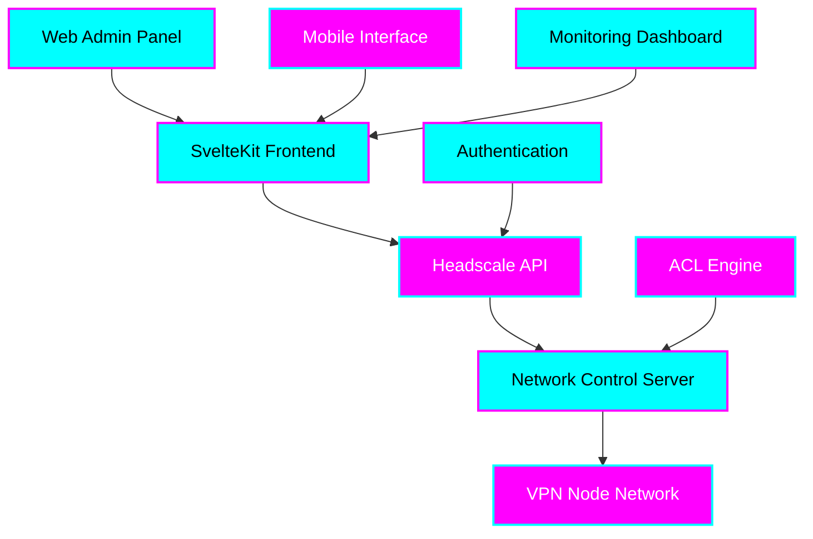

# Tiation Headscale Admin

<div align="center">


**Enterprise-grade VPN Network Management Platform**

*Professional • Scalable • Secure • Mobile-Optimized*

[](https://tiation.github.io/headscale-admin)
[](https://tiation.github.io/headscale-admin)
[](https://tiation.github.io/headscale-admin/architecture)
[](https://github.com/tiation/headscale-admin)
[](https://github.com/tiation/headscale-admin/blob/main/LICENSE)
[](https://tiation.github.io/headscale-admin)

</div>

## 🚀 Overview

Tiation Headscale Admin is an enterprise-grade web-based management platform for Headscale, the open-source implementation of the Tailscale control server. Built with SvelteKit and featuring a stunning dark neon theme with cyan/magenta gradients, this platform provides comprehensive VPN network management capabilities with enterprise-level security and scalability.

### ✨ Key Features

- 🎯 **Comprehensive Network Management** - Full control over VPN nodes, users, and routes
- 🔧 **Real-time Monitoring** - Live status updates and network health monitoring
- 🌟 **Enterprise Security** - Advanced ACL management and security policies
- 🛡️ **Mobile-First Design** - Responsive interface optimized for all devices
- ⚡ **Performance Optimized** - Fast, efficient operations with modern web technologies
- 🎨 **Dark Neon Theme** - Professional UI with cyan/magenta gradient accents
- 🔐 **Pre-Auth Key Management** - Secure device onboarding workflows
- 📊 **Analytics Dashboard** - Comprehensive network insights and reporting

---

## 🏗️ Architecture


### System Components



### Technology Stack

- **Frontend**: SvelteKit with TypeScript, TailwindCSS & Skeleton UI
- **Backend**: Headscale API integration with REST endpoints
- **Styling**: Dark neon theme with cyan/magenta gradients
- **Build Tools**: Vite, PostCSS, ESLint, Prettier
- **Testing**: Vitest for unit and integration testing
- **Mobile**: Responsive design optimized for all screen sizes
- **Icons**: Iconify with Material Design Icons
- **Deployment**: Static site generation with GitHub Pages

---

## 📋 Table of Contents

- [Features](#-features)
- [Quick Start](#-quick-start)
- [Installation](#-installation)
- [Usage](#-usage)
- [Documentation](#-documentation)
- [Screenshots](#-screenshots)
- [FAQ](#-faq)
- [Contributing](#-contributing)
- [Support](#-support)
- [License](#-license)
- [About Tiation](#-about-tiation)

---

## ✨ Features

### 🏢 Enterprise Network Management
- **User Management** - Create, modify, and delete VPN users with role-based access
- **Node Administration** - Monitor and control all connected VPN nodes
- **Route Management** - Configure and manage network routing policies
- **Pre-Auth Keys** - Generate secure keys for streamlined device onboarding

### 🔐 Security & Compliance
- **ACL Engine** - Advanced access control list management
- **Authentication** - Secure API key-based authentication
- **Audit Logging** - Comprehensive activity tracking and reporting
- **Network Policies** - Granular control over network access permissions

### 📊 Monitoring & Analytics
- **Real-time Status** - Live monitoring of network health and node status
- **Performance Metrics** - Detailed analytics and usage statistics
- **Interactive Dashboard** - Comprehensive overview of network state
- **Alert System** - Proactive notifications for network issues

### 🎨 User Experience
- **Dark Neon Theme** - Professional interface with cyan/magenta accents
- **Mobile Responsive** - Optimized for tablets, phones, and desktop
- **Fast Performance** - Built with modern web technologies for speed
- **Intuitive Navigation** - Clean, organized interface design

---

## 🏃‍♂️ Quick Start

```bash
# Clone the repository
git clone https://github.com/tiation/headscale-admin.git
cd headscale-admin

# Install dependencies
npm install

# Run the application
npm run dev
```

---

## 📦 Installation

### Prerequisites

- **Node.js** 18.0 or higher
- **npm** 8.0 or higher
- **Headscale Server** - Running instance with API access
- **Modern Browser** - Chrome, Firefox, Safari, or Edge

### Installation Steps

1. **Clone the repository**
   ```bash
   git clone https://github.com/tiation/headscale-admin.git
   cd headscale-admin
   ```

2. **Install dependencies**
   ```bash
   npm install
   ```

3. **Configuration**
   ```bash
   # Copy environment template
   cp .env.example .env
   
   # Edit configuration
   nano .env
   ```

4. **Development Server**
   ```bash
   npm run dev
   ```

5. **Production Build**
   ```bash
   npm run build
   npm run preview
   ```

---

## 🎯 Usage

### Basic Usage

1. **Connect to Headscale**
   - Navigate to Settings page
   - Enter your Headscale server URL
   - Provide API key for authentication
   - Save configuration and test connection

2. **Manage Users**
   - View all registered users in Users tab
   - Create new users with custom parameters
   - Monitor user activity and connected devices
   - Generate pre-auth keys for user onboarding

3. **Monitor Nodes**
   - Track all connected VPN nodes
   - View online/offline status in real-time
   - Access detailed node information
   - Manage node permissions and settings

### Advanced Usage

1. **ACL Configuration**
   - Create complex access control rules
   - Test ACL policies before deployment
   - Monitor rule effectiveness and usage
   - Export/import ACL configurations

2. **Route Management**
   - Configure subnet routing
   - Set up exit nodes and relay servers
   - Monitor route advertisement and usage
   - Troubleshoot routing issues

3. **Enterprise Deployment**
   - Deploy using Docker containers
   - Set up reverse proxy with SSL/TLS
   - Configure enterprise authentication
   - Implement monitoring and logging

### Examples

**Creating a new user:**
```javascript
// Navigate to Users > Add User
{
  "name": "engineering-team",
  "preAuthKeys": 5,
  "expiration": "2024-12-31T23:59:59Z"
}
```

**Setting up ACL rules:**
```json
{
  "groups": {
    "engineering": ["user:alice", "user:bob"],
    "management": ["user:charlie"]
  },
  "acls": [
    {
      "action": "accept",
      "src": ["group:engineering"],
      "dst": ["192.168.1.0/24:*"]
    }
  ]
}
```

---

## 📚 Documentation

- **[User Guide](docs/user-guide.md)** - Complete user documentation
- **[API Reference](docs/api-reference.md)** - Technical API documentation
- **[Architecture](docs/architecture.md)** - System architecture overview
- **[Deployment Guide](docs/deployment.md)** - Production deployment instructions
- **[Developer Guide](docs/developer-guide.md)** - Development setup and guidelines

### Live Documentation

Visit our [GitHub Pages site](https://tiation.github.io/headscale-admin) for interactive documentation.

---

## 📸 Screenshots

<div align="center">
  
  <p><em>Main application interface</em></p>
</div>

<div align="center">
  
  <p><em>Analytics dashboard</em></p>
</div>

---

## ❓ FAQ

### General Questions

**Q: What makes this solution enterprise-grade?**
A: Our solution includes comprehensive security, scalability, monitoring, and enterprise integration features with professional support.

**Q: Is this compatible with existing systems?**
A: Yes, we provide extensive API and integration capabilities for seamless system integration.

**Q: What support options are available?**
A: We offer community support through GitHub Issues and professional enterprise support for commercial users.

### Technical Questions

**Q: What are the system requirements?**
A: Node.js 18+, npm 8+, modern browser, and a running Headscale server with API access. Minimum 2GB RAM recommended for development, 4GB+ for production.

**Q: How do I handle large scale deployments?**
A: See our [Deployment Guide](docs/deployment.md) for enterprise-scale deployment strategies.

**Q: Are there any security considerations?**
A: Yes, please review our [Security Guide](docs/security.md) for comprehensive security best practices.

### Troubleshooting

**Q: Common installation issues**
A: Check our [Troubleshooting Guide](docs/troubleshooting.md) for solutions to common problems.

**Q: Performance optimization**
A: Refer to our [Performance Guide](docs/performance.md) for optimization strategies.

---

## 🤝 Contributing

We welcome contributions! Please see our [Contributing Guide](CONTRIBUTING.md) for details.

### Development Setup

1. Fork the repository
2. Create a feature branch
3. Make your changes
4. Add tests
5. Submit a pull request

### Code of Conduct

Please read our [Code of Conduct](CODE_OF_CONDUCT.md) before contributing.

---

## 🆘 Support

### Community Support

- **GitHub Issues**: [Report bugs or request features](https://github.com/tiation/headscale-admin/issues)
- **Discussions**: [Join community discussions](https://github.com/tiation/headscale-admin/discussions)
- **Documentation**: [Browse our documentation](https://tiation.github.io/headscale-admin)

### Enterprise Support

For enterprise customers, we offer:
- Priority support
- Custom development
- Training and consultation
- SLA guarantees

Contact us at [tiatheone@protonmail.com](mailto:tiatheone@protonmail.com)

---

## 🔮 Tiation Ecosystem

This repository is part of the Tiation ecosystem. Explore related projects:

- [🌟 Tiation Platform](https://github.com/tiation/tiation-ai-platform) - Enterprise AI platform
- [🤖 AI Agents](https://github.com/tiation/tiation-ai-agents) - Intelligent automation
- [⚡ Terminal Workflows](https://github.com/tiation/tiation-terminal-workflows) - Developer tools
- [🐳 Docker Solutions](https://github.com/tiation/tiation-docker-debian) - Container orchestration
- [📝 CMS](https://github.com/tiation/tiation-cms) - Content management system
- [🐰 ChaseWhiteRabbit NGO](https://github.com/tiation/tiation-chase-white-rabbit-ngo) - Social impact initiatives
- [🏗️ Infrastructure](https://github.com/tiation/tiation-rigger-infrastructure) - Enterprise infrastructure

---

## 📄 License

This project is licensed under the MIT License - see the [LICENSE](LICENSE) file for details.

---

## 🌟 About Tiation

**Tiation** is a leading provider of enterprise-grade software solutions, specializing in automation, productivity, and system integration tools. Our mission is to empower organizations with cutting-edge technology that drives efficiency and innovation.

### Our Solutions

- **Automation Platform**: Comprehensive business process automation
- **Developer Tools**: Professional development and deployment tools
- **Enterprise Integration**: Seamless system integration solutions
- **Security Framework**: Advanced security and compliance tools

### Connect With Us

- **Website**: [https://github.com/tiation](https://github.com/tiation)
- **GitHub**: [https://github.com/tiation](https://github.com/tiation)
- **LinkedIn**: [Tiation Company](https://linkedin.com/company/tiation)
- **Twitter**: [@TiationTech](https://twitter.com/TiationTech)

---

<div align="center">
  <p>
    <strong>Built with ❤️ by the Tiation Team</strong>
  </p>
  <p>
    <a href="https://github.com/tiation">
      
    </a>
  </p>
</div>
